# SYSTEM ARCHITECTURE & MODULAR DATAFLOW GRAPH
## E-Waste Bridge: Autonomous Vernacular Voice & Reverse Logistics Platform
**Smart India Hackathon 2026 | Problem Statement 2 (SIH PS2)**

---

## 1. Modular 4-Pillar Presentation Graph (Slide Format)

```mermaid
flowchart LR
    %% ─────────────────────────────────────────────────────────────────────────────
    %% PILLAR 1: SENSING & REAL-TIME AUDIO INTAKE (BLUE)
    %% ─────────────────────────────────────────────────────────────────────────────
    subgraph P1 ["SENSING & REAL-TIME AUDIO INGESTION"]
        direction TB
        C1["<b>1. PHONE AUDIO & HARDWARE GAIN</b><br/>(Web Audio API MediaStreamSource)<br/>u(t) &isin; &Ropf;<sup>128</sup> &bull; Gain: 1.4x &ndash; 3.5x boost<br/>RMS = min(100, round(rms &times; 650)) @ 25Hz"]
        
        C2["<b>2. 3-PHASE CALIBRATION & VAD GATE</b><br/>(Acoustic Noise Floor + Anti-Interruption Lock)<br/>P1 Silence (3s) &bull; P2 Gap (2s) &bull; P3 Peak (10s)<br/>&tau; = max(2, round(floor + (peak-floor)&times;0.22))<br/>&Delta;t &ge; 450ms pause + 250ms debounce &bull; Hold Lock"]

        C1 --> C2
    end

    %% ─────────────────────────────────────────────────────────────────────────────
    %% PILLAR 2: VERNACULAR NLP & AI AGENT CORE (PURPLE)
    %% ─────────────────────────────────────────────────────────────────────────────
    subgraph P2 ["VERNACULAR NLP & AI AGENT CORE"]
        direction TB
        C3["<b>3. VERNACULAR NORMALIZATION NET</b><br/>(Disfluency Stripper + Backtracking Repair)<br/>Strips 'um', 'matlab' &bull; '10 kg nahi 12 kg' &rarr; 12kg<br/>Fractions: dhai &rarr; 2.5, dedh &rarr; 1.5, sawa &rarr; +0.25"]

        C4["<b>4. MULTILINGUAL SCRIPT & LANG ROUTER</b><br/>(Tri-Lingual Zero-Latency Classifier)<br/>Hindi (hi) / Marathi (mr) / Indian English (en)<br/>Unicode Regex Router &bull; Collector dialect persistence"]

        C5["<b>5. INTENT DISPATCHER & DEICTIC FUSION</b><br/>(VoiceAdapter Single Gateway Router)<br/>CREATE_LOT &bull; PRICE_INQUIRY &bull; CHECK_EARNINGS<br/>'Beech wala' &rarr; Idx 1 &bull; 'Sabse achha' &rarr; max(Payout)"]

        C3 --> C4
        C4 --> C5
    end

    %% ─────────────────────────────────────────────────────────────────────────────
    %% PILLAR 3: CPCB POLICY & REVERSE LOGISTICS (ORANGE)
    %% ─────────────────────────────────────────────────────────────────────────────
    subgraph P3 ["CPCB POLICY & REVERSE LOGISTICS"]
        direction TB
        
        subgraph P3_TOP ["POLICY & HAZARDS"]
            direction LR
            C6["<b>6. CPCB STATUTORY TAXONOMY</b><br/>Non-E-Waste Rejection: Aloo, Pyaz, Steel<br/>Slang Mapping: 'laptop ka maal' &rarr; ITEW2"]
            C7["<b>7. HAZARD & SMELTING BLOCK</b><br/>Lithium Swelling Fire Risk Alert<br/>Acid Leaching & Cable Burning Intercept"]
        end

        C8["<b>8. DYNAMIC 3-BIDDER REVERSE LOGISTICS</b><br/>3 Authorized Recyclers: GreenTech / Apex / EcoGreen<br/>Haversine Matrix (d &le; 15 km) &bull; Net = Gross - Logistics - Platform Fee"]

        subgraph P3_BOT ["SETTLEMENT & FIELD SYNC"]
            direction LR
            C9["<b>9. HIGH-VALUE GATE</b><br/>Value &ge; &#x20B9;1,00,000 INR<br/>5,000ms Touch-and-Hold"]
            C9A["<b>9A. CPCB FORM 6 MANIFEST</b><br/>QR Code Traceability<br/>Chain of Custody & EPR Credit"]
            C9B["<b>9B. OFFLINE FIELD QUEUE</b><br/>Encrypted SQLite Cache<br/>Resilient Reconciliation"]
        end

        P3_TOP --> C8
        C8 --> P3_BOT
    end

    %% ─────────────────────────────────────────────────────────────────────────────
    %% PILLAR 4: STATE MACHINE, LEDGER & SWEET TTS (GREEN)
    %% ─────────────────────────────────────────────────────────────────────────────
    subgraph P4 ["STATE MACHINE, LEDGER & SWEET TTS"]
        direction TB
        C10["<b>10. DETERMINISTIC LOT STATE MACHINE & LEDGER</b><br/>(LotStore FSM + Real-Time Telemetry)<br/>DRAFT &rarr; QUOTED &rarr; ACCEPTED &rarr; SETTLED<br/>Sync: monthlyEarnings, monthlyWeight &bull; Instant cash drop"]

        C11["<b>11. SWEET FEMALE NEURAL VERNACULAR TTS</b><br/>(AI4Bharat IndicF5 + Microsoft Swara / Aarohi / Neerja)<br/>Male Synthesizer Filter: isMaleVoice() == FALSE<br/>Loving Prosody: pitch = 1.16, rate = 0.88, volume = 1.0<br/>Phonetic Currency Normalizer: INR &rarr; Devanagari words"]

        C10 --> C11
    end

    %% Inter-Pillar Main Dataflow Bridges (Left to Right)
    C2 ==>|Utterance Commit| C3
    C5 ==>|Statutory Gate| P3_TOP
    C5 ==>|Direct Reverse Tender| C8
    C8 ==>|Accepted Manifest| C10

    %% Cross-Pillar Feedback Loops
    C11 -. Barge-In Abort .-> C2
    C10 -. Telemetry Balance Sync .-> C5

    %% Styling
    classDef blueZone fill:#EBF3FE,stroke:#2563EB,stroke-width:2px,color:#0F172A;
    classDef purpleZone fill:#F3E8FF,stroke:#7C3AED,stroke-width:2px,color:#0F172A;
    classDef orangeZone fill:#FFFBEB,stroke:#EA580C,stroke-width:2px,color:#0F172A;
    classDef greenZone fill:#F0FDF4,stroke:#16A34A,stroke-width:2px,color:#0F172A;

    class C1,C2 blueZone;
    class C3,C4,C5 purpleZone;
    class C6,C7,C8,C9,C9A,C9B orangeZone;
    class C10,C11 greenZone;
```

---

## 2. Detailed Technical Specifications by Module

## 2. Detailed Technical Specifications by Module

### Pillar 1: Sensing & Real-Time Audio Ingestion (Blue)

#### Module 1: Phone Audio & Hardware Gain (`CollectorPhoneWrapper.jsx`)
* **Input**: Web Audio API raw audio stream `navigator.mediaDevices.getUserMedia()`.
* **Hardware Signal Processing**:
  * `AudioContext` with `echoCancellation: true`, `noiseSuppression: true`, `autoGainControl: true`.
  * `GainNode`: Boosts quiet laptop/mobile internal microphones by $1.4\times$ to $3.5\times$.
  * `AnalyserNode`: 128-point FFT buffer (`getFloatTimeDomainData`).
  * RMS Calculation: $\text{Level} = \min(100, \text{round}(\text{RMS} \times 650))$ computed at $25\text{ Hz}$ ($40\text{ms}$ intervals).
* **Output**: Real-time integer audio level $(0 \le L \le 100)$ driving the LED VU bar and VAD engine.

#### Module 2: 3-Phase Calibration & VAD Gate (`VoiceCalibrationModal.jsx` & `TurnManager.js`)
* **Timing State Machine**:
  * **Phase 1 (Room Silence Floor)**: $3.0\text{ seconds}$ ($75\text{ samples}$ @ $40\text{ms}$) to measure ambient room/fan noise floor.
  * **Phase 2 (Preparation Gap)**: $2.0\text{ seconds}$ countdown so the collector prepares to speak naturally without corrupting the baseline.
  * **Phase 3 (Vocal Peak)**: $10.0\text{ seconds}$ ($250\text{ samples}$ @ $40\text{ms}$) of unhurried vernacular speech to extract dynamic peak harmonics.
* **Auto-Tuning Formulation**:
  $$\tau_{\text{speech}} = \max\left(2, \operatorname{round}\left(\text{floor} + (\text{peak} - \text{floor}) \times 0.22\right)\right)$$
* **Dual-State VAD & Anti-Interruption Turn Manager**:
  * States: `LISTENING` $\longleftrightarrow$ `PAUSED_WAITING` $\longrightarrow$ `PROCESSING`.
  * $\Delta t_{\text{silence}} \ge 450\text{ms}$ pause $+ 250\text{ms}$ debounced commit.
  * **Physical Hold Gate**: Physical voice orb touch locks the engine and suppresses premature commits during conversational hesitations.

---

### Pillar 2: Vernacular NLP & AI Agent Core (Purple)

#### Module 3: Speech Normalization Net (`SpeechNormalizer.js`)
* **Disfluency Stripping**: Removes conversational hesitation tokens (*"um"*, *"uh"*, *"matlab"*, *"hmmm"*).
* **Backtracking & Mid-Sentence Repair**:
  * Detects repair markers (*"nahi nahi"*, *"actually"*, *"sorry"*, *"badal ke"*).
  * Example: *"10 kilo purane laptop... nahi nahi 12 kilo"* $\longrightarrow 12\text{ kg Laptops}$.
* **Vernacular Fractional Arithmetic**:
  * *सवा (sawa)*: $+0.25$ $\cdot$ *पौने (paune)*: $-0.25$ $\cdot$ *डेढ़ (dedh)*: $1.5$ $\cdot$ *ढाई (dhai)*: $2.5$.

#### Module 4: Multilingual Script & Language Router (`LanguageDetector.js`)
* **Supported Locales**: Hindi (`hi`), Marathi (`mr`), Indian English (`en`).
* **Zero-Latency Router**: Uses Unicode Devanagari range matching and verb terminal markers (*"आहेत"* $\to$ Marathi; *"हैं"* $\to$ Hindi).
* **Dialect Persistence**: Retains collector dialect preferences across active sessions.

#### Module 5: Intent Dispatcher & Deictic Fusion (`voiceAgentEngine.js`)
* **Single Gateway Protocol**: All inputs flow through `VoiceAdapter.processTranscript()`.
* **Intent Engine**: Classifies commands into `CREATE_LOT`, `PRICE_INQUIRY`, `CHECK_EARNINGS`, `TRIGGER_CAMERA`.
* **Deictic UI Grounding**:
  * *"Beech wala"* $\longrightarrow$ Resolves to index 1 of visible marketplace offers.
  * *"Sabse achha wala"* $\longrightarrow$ Resolves to $\max(\text{Net Payout})$.

---

### Pillar 3: CPCB Policy & Reverse Logistics (Orange)

#### Module 6: CPCB Statutory Taxonomy Engine (`cpcbPolicyEngine.js`)
* **Non-E-Waste Rejection Guard**:
  * Intercepts agricultural produce (*aloo, pyaz*), paper/raddi, ferrous construction steel, plastic bottles.
  * Slang Mapping: Translates informal scrap terms (*"laptop ka maal"*, *"battery ka kachra"*) to official CPCB codes (`ITEW2`, `CEEW`).

#### Module 7: Hazard & Acid Smelting Block (`cpcbPolicyEngine.js`)
* **Hazardous Waste Interception**:
  * Punctured / swollen lithium-ion battery fire risk.
  * Toxic informal acid leaching and wire burning (banned under statutory CPCB Rule 14).
  * Immediately triggers hazardous containment instructions and locks the lot.

#### Module 8: Dynamic 3-Bidder Reverse Logistics Engine (`logisticsEngine.js`)
* **Live Competitive Bidding**: Real-time tender with authorized formal recyclers (GreenTech, Apex, EcoGreen).
* **Reverse Logistics Routing**: Haversine distance matrix lookup ($d \le 15\text{ km}$).
* **Accounting Formula**:
  $$\text{Net Payout} = \text{Gross Bid} - \text{Logistics Cost} - \text{Platform Fee}$$

#### Module 9: High-Value Transaction Gate (`cpcbPolicyEngine.js`)
* **Threshold**: $\text{Net Payout} \ge ₹1,00,000\text{ INR}$.
* **Physical Touch-and-Hold Mandate**: Standard single tap or voice commit is blocked. Enforces **5,000 milliseconds** continuous physical touch. Release $< 5.0\text{s} \to$ `INSUFFICIENT_HOLD_DURATION`.

#### Module 9A: CPCB Form 6 Electronic Manifest (`LotStore.js`)
* Electronic manifest generation with unique QR traceability passes (`EWB-QR-...`), verified timestamps, and EPR Green Credit issuance.

#### Module 9B: Offline Field Queue & Resilient Sync (`LotStore.js`)
* Encrypted local queue (`localStorage` / SQLite) ensuring zero data-loss during remote field collections with autonomous reconciliation on reconnect.

---

### Pillar 4: State Machine, Ledger & Sweet TTS (Green)

#### Module 10: Deterministic Lot State Machine & Ledger (`LotStore.js` & `CollectorHome.jsx`)
* **State Space**: $\text{DRAFT} \longrightarrow \text{QUOTED} \longrightarrow \text{ACCEPTED} \longrightarrow \text{SETTLED}$ (strict transition integrity).
* **Fintech Synchronization**: Live sync of `monthlyEarningsInr`, `monthlyWeightKg`, and $\sum(\text{unsettled lots})$ pending dues.
* **Instant Cash Disbursement**: Instant payout trigger upon verified physical drop-off.

#### Module 11: Sweet Female Neural Vernacular TTS (`voiceSynthesis.js` & `ttsNormalizer.js`)
* **Phonetic Normalizer**: Translates currency symbols and fractions to spoken Devanagari words (*₹2,960* $\to$ *दोन हजार नऊशे साठ रुपये*).
* **Layer 1 (Studio Bank)**: Pre-synthesized AI4Bharat `IndicF5` audio cache for instant response.
* **Layer 2 (Sweet Female Neural Browser Synthesis)**:
  * Hindi: `Microsoft Swara Online (Natural)` $\cdot$ Marathi: `Microsoft Aarohi Online (Natural)` $\cdot$ English: `Microsoft Neerja Online (Natural)`
  * **Strict Male Filter**: Bans `Microsoft Hemant`, `Madhur`, `Prabhat`, `David`, and robotic desktop synthesizers.
* **Loving Acoustic Prosody**: Pitch $= 1.16$, Rate $= 0.88$, Volume $= 1.0$.
* **Barge-In Interruption**: User speech immediately cancels TTS audio playback with zero latency.

---

## 3. Technology Stack & Frameworks

| Function | Open-Source / Client-Side Technology | Role in E-Waste Bridge |
| :--- | :--- | :--- |
| **Frontend Framework** | React 19 + Vite 8 | Ultra-fast client runtime (300ms bundle build). |
| **Motion Physics** | Motion (motion/react) | Spring transitions, card entry, VU pulse meters. |
| **Audio Processing** | Web Audio API (Hardware AudioContext) | FFT analysis, real-time RMS metering, hardware gain boost. |
| **Speech Normalization** | Custom Regex & Devanagari Tokenizer | Backtracking repair, disfluency stripping, fraction expansion. |
| **Speech Synthesis (TTS)** | Web Speech API Neural Voice Engine | Microsoft Swara, Aarohi, Neerja neural synthesis. |
| **Speech Audio Bank** | AI4Bharat IndicF5 Studio Model | Pre-synthesized warm vernacular studio clips. |
| **Icons & Design** | Lucide React + Clean Typography | 100% SVG iconography, strictly zero emojis. |
| **Deployment** | Netlify Edge CDN | Global low-latency delivery, PWA offline manifest. |
