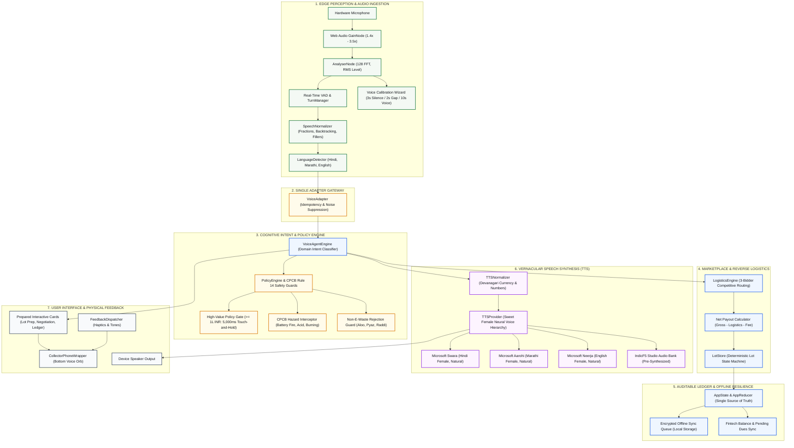
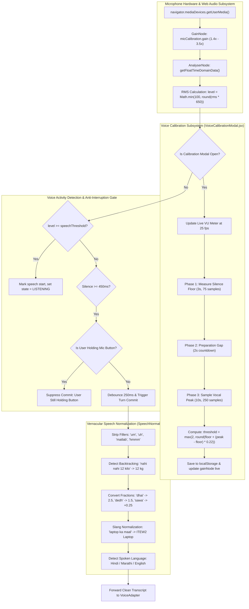
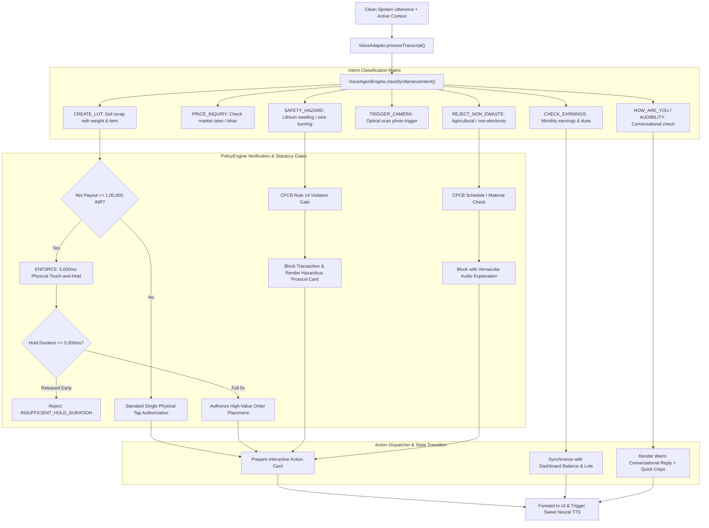
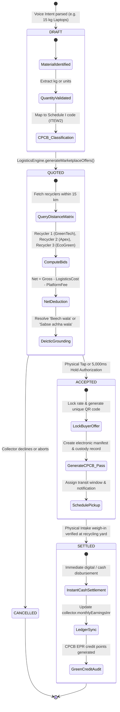
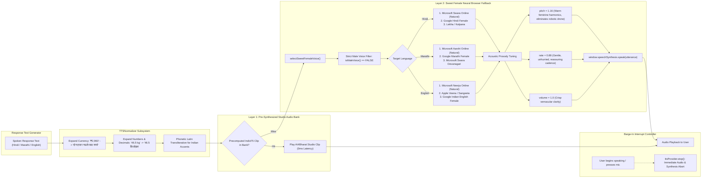

# System Architecture & Modular Dataflow Graphs
## E-Waste Bridge: Autonomous Vernacular Voice & Reverse Logistics Platform
**Smart India Hackathon 2026 | Problem Statement 2 (SIH PS2)**

---

## 1. High-Level Modular System Architecture (Executive Slide)

---

## 2. Edge Audio Processing & Turn Management (Deep-Dive Slide)

---

## 3. Cognitive Agent & Statutory Policy Enforcement (Security & Compliance Slide)

---

## 4. Reverse Logistics, Marketplace Bidding & Lot Lifecycle (Business Slide)

---

## 5. Sweet Female Neural Voice & Speech Synthesis (Voice Persona Slide)

---

## 6. Full Codebase Component Mapping Matrix

| Layer | Primary Source File | Core Classes & Functions | Purpose & Responsibility |
| :--- | :--- | :--- | :--- |
| **Edge Audio** | `src/components/collector/CollectorPhoneWrapper.jsx` | `startLiveMicAudio()`, `updateVolume()` | Web Audio API setup, gain boosting, real-time RMS metering. |
| **Calibration** | `src/components/collector/VoiceCalibrationModal.jsx` | `startAutoCalibration()`, `applyPreset()` | 3s silence, 2s gap, 10s voice peak, adaptive threshold auto-tuning. |
| **Turn Manager** | `src/voice/turn/TurnManager.js` | `TurnManager`, `onInterim()`, `commitTurn()` | Concurrency control, pause buffers, anti-interruption hold logic. |
| **Normalizer** | `src/voice/normalization/SpeechNormalizer.js` | `SpeechNormalizer.normalize()` | Devanagari numerals, vernacular fractions, filler stripping, repairs. |
| **Single Adapter** | `src/voice/VoiceAdapter.js` | `processTranscript()`, `resetAdapterSession()` | Single gateway, noise artifact filtering, idempotency guards. |
| **Agent Engine** | `src/services/voiceAgentEngine.js` | `processAgentUtterance()`, `classifyUtteranceIntent()` | Intent classification, entity extraction, prepared card generation. |
| **Policy Engine** | `src/voice/policy/PolicyEngine.js` | `PolicyEngine.evaluate()` | Statutory gates: 5,000ms hold for $\ge$ ₹1L, CPCB safety blocks. |
| **Lot State** | `src/domain/lots/LotStore.js` | `LotStore`, `LotStatus` | Deterministic lifecycle: DRAFT $\to$ QUOTED $\to$ ACCEPTED $\to$ SETTLED. |
| **TTS Engine** | `src/voice/tts/TTSProvider.js` | `TTSProvider`, `selectSweetFemaleVoice()` | Male voice blocking, Swara/Aarohi/Neerja selection, prosody shaping. |
| **Phonetics** | `src/voice/tts/TTSNormalizer.js` | `normalizeForTTS()` | Converts currency symbols and decimals into phonetic Devanagari text. |
| **Audio Bank** | `src/data/indicF5AudioBank.js` | `IndicF5AudioBank.findMatch()` | Zero-latency studio audio playback for standard vernacular phrases. |
| **App State** | `src/context/MarketplaceContext.jsx` | `MarketplaceProvider`, `useMarketplace()` | Global state shim, offline synchronization queue, fintech sync. |

---

## 7. Key System Differentiators for Hackathon Evaluation

1. **100% Zero-Paid-API Architecture**: Operates entirely on client-side Web Audio API, browser neural synthesis, and local Whisper without paying external speech API costs.
2. **CPCB Statutory Guard Rails**: Programmatically enforces E-Waste Management Rules 2022 (Hazardous waste interception, Rule 14 manifest tracking, and 5-second hold confirmation on transactions $\ge$ ₹1,00,000).
3. **True Vernacular Inclusion**: Handles Indian vernacular fractions (*सवा, पौने, डेढ़, ढाई*), mid-sentence corrections (*"नहीं नहीं 12 किलो"*), and Devanagari financial readouts.
4. **Sweet, Empathetic Audio Persona**: Completely eliminates robotic male desktop synthesizers, utilizing warm neural female voices tuned to unhurried, reassuring prosody (*pitch 1.16, rate 0.88*).
5. **Field Resilience**: Encrypted offline-first queue preserves transactions in disconnected scrap yard environments and automatically flushes when reconnected.
